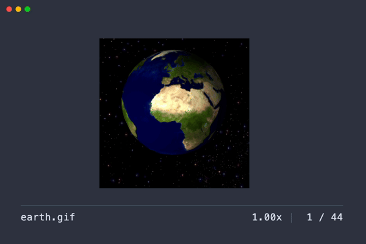
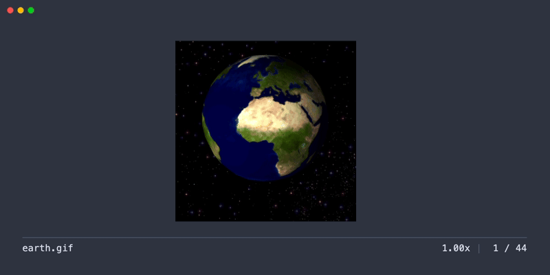
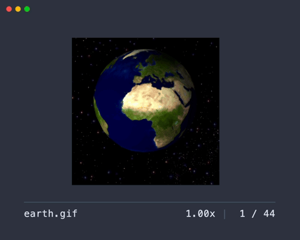

# LPX

[](https://crates.io/crates/lpx)

Terminal Animated GIF Viewer 📽️



(Check out the [Screenshots](#screenshots) for more demos of how it works!)

## About

LPX is a tool for displaying GIF animations directly in the terminal.

It features the following capabilities:

- Image rendering using image display protocols (iTerm2, kitty)
- Interactive controls such as play, pause, and frame-by-frame stepping
- Loop playback of a selected range
- Flexible display modes, including full-screen and inline viewing

## Requirements

> [!WARNING]
> This tool requires a terminal emulator that supports following image protocols.
> It will not work in environments without these protocols, and there is no text-based fallback.

### Supported terminal emulators

The following image protocols are supported:

- [Inline Images Protocol (iTerm2)](https://iterm2.com/documentation-images.html)
- [Terminal graphics protocol (kitty)](https://sw.kovidgoyal.net/kitty/graphics-protocol/)

Confirmed working terminal emulators are listed below. Other emulators supporting these protocols may also work, though they have not been explicitly tested.

#### Inline Images Protocol (iTerm2)

- [iTerm2](https://iterm2.com)
- [WezTerm](https://wezfurlong.org/wezterm/)
- [VSCode integrated terminal](https://code.visualstudio.com/docs/terminal/basics) \*1 \*2

\*1 Requires the [`terminal.integrated.enableImages` setting](https://code.visualstudio.com/docs/terminal/advanced#_image-support) to be enabled.

\*2 Any terminal emulator using [xterm.js](https://xtermjs.org) (like the VSCode terminal) may work if the [image display feature is enabled](https://github.com/xtermjs/xterm.js/tree/master/addons/addon-image).

#### Terminal graphics protocol (kitty)

- [kitty](https://sw.kovidgoyal.net/kitty/)
- [Ghostty](https://ghostty.org)

### Unsupported environments

- Sixel graphics is not supported.
- Terminal multiplexers (screen, tmux, Zellij, etc.) are not supported.
- Windows is not supported.

## Installation

### [Cargo](https://crates.io/crates/lpx)

```
$ cargo install --locked lpx
```

### [Homebrew](https://github.com/lusingander/homebrew-tap/blob/master/lpx.rb)

```
$ brew install lusingander/tap/lpx
```

### [AUR](https://aur.archlinux.org/packages/lpx)

```
$ paru -S lpx
```

### Downloading binary

You can download pre-compiled binaries from [releases](https://github.com/lusingander/lpx/releases).

## Usage

After installation, run the following command:

```
$ lpx path/to/your/image.gif
```

### Options

```
LPX - Terminal Animated GIF Viewer 📽️

Usage: lpx [OPTIONS] <FILE>

Arguments:
  <FILE>  Path to the image file

Options:
  -p, --protocol <TYPE>    Select the graphics protocol [default: auto] [possible values: auto, iterm, kitty]
  -n, --frame-step <N>     Number of frames to skip per step action [default: 10]
  -w, --max-width <WIDTH>  Limit the maximum width of the UI
  -i, --inline <HEIGHT>    Enable inline mode with the specified height in rows
  -h, --help               Print help
  -V, --version            Print version
```

### Keybindings

| Key                                   | Description                                      |
| ------------------------------------- | ------------------------------------------------ |
| <kbd>q</kbd> <kbd>Esc</kbd> <kbd>Ctrl-C</kbd> | Quit application                                 |
| <kbd>Space</kbd>                      | Play / Pause                                     |
| <kbd>h</kbd> / <kbd>l</kbd> or <kbd>←</kbd> / <kbd>→</kbd> | Move to previous / next frame                    |
| <kbd>H</kbd> / <kbd>L</kbd> or <kbd>Shift</kbd> + <kbd>←</kbd> / <kbd>→</kbd> | Move backward / forward by frame step count      |
| <kbd>0</kbd> - <kbd>9</kbd>           | Jump to percentage (0% to 90%)                   |
| <kbd>j</kbd> / <kbd>k</kbd> or <kbd>↓</kbd> / <kbd>↑</kbd> | Decrease / Increase playback speed               |
| <kbd>[</kbd> / <kbd>]</kbd>           | Set loop start / end point                       |
| <kbd>C</kbd>                          | Clear loop range                                 |
| <kbd>d</kbd>                          | Toggle detailed information display              |

## Screenshots

### Show detailed information



### Loop a specific range


### Change playback speed



### Inline mode


## License

MIT
